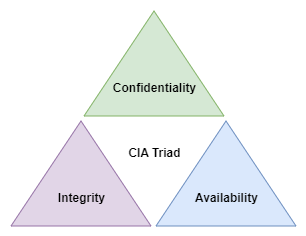
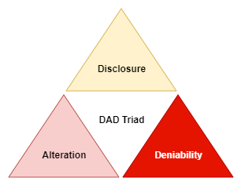
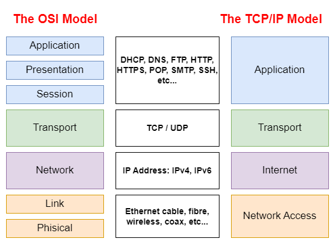
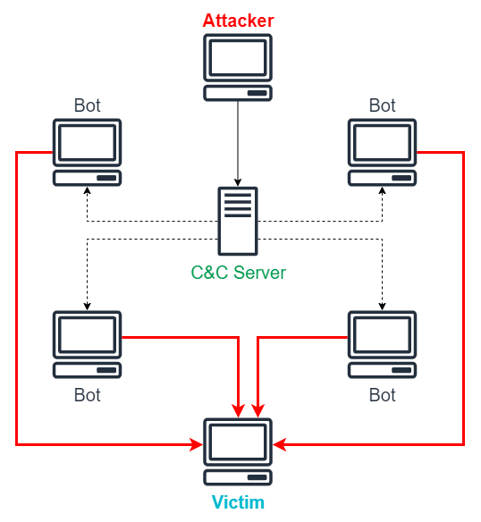
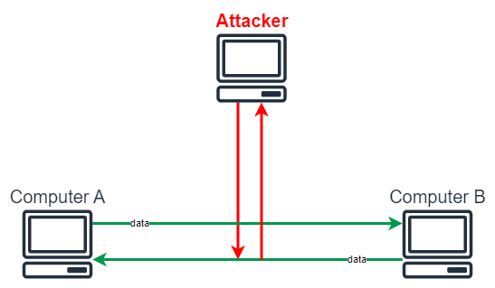
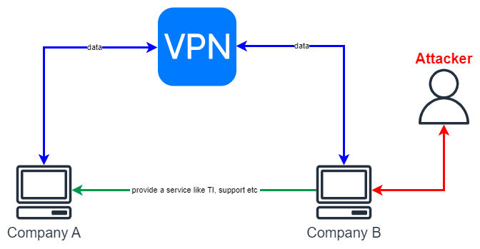
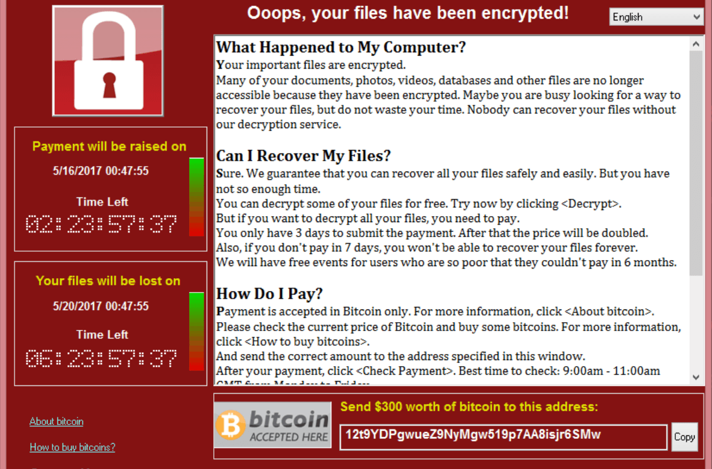
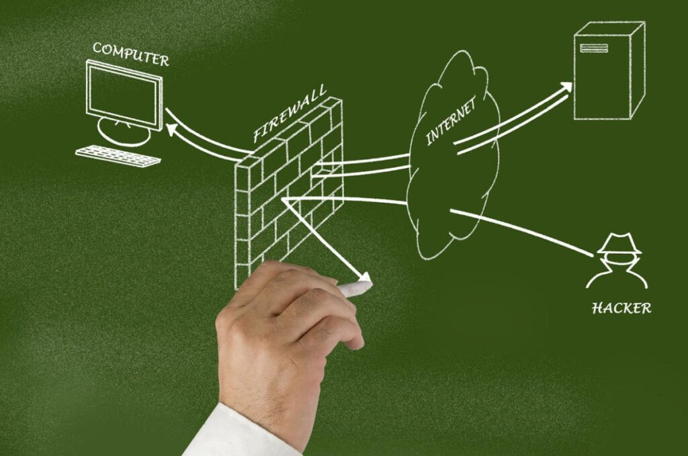
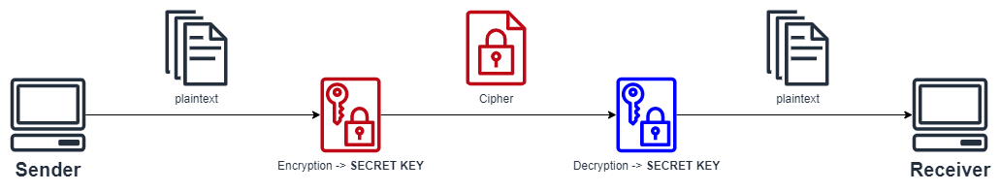
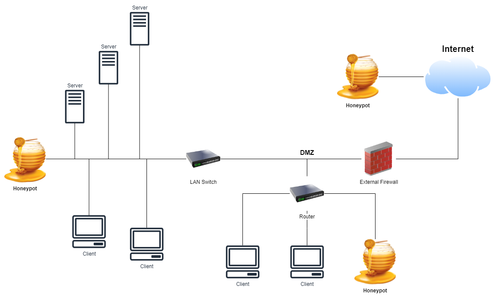

# Cybersecurity <!-- omit in toc -->

## Contents <!-- omit in toc -->

- [1. Information Security vs Cybersecurity](#1-information-security-vs-cybersecurity)
- [2. CIA](#2-cia)
  - [2.1. Confidentiality](#21-confidentiality)
  - [2.2. Integrity](#22-integrity)
  - [2.3. Availability](#23-availability)
- [3. DAD](#3-dad)
  - [3.1. Disclosure](#31-disclosure)
  - [3.2. Alteration](#32-alteration)
  - [3.3. Deniability](#33-deniability)
- [4. Computer protocols](#4-computer-protocols)
  - [4.1. HTTP \& HTTPs](#41-http--https)
  - [4.2. SSL \& SSH](#42-ssl--ssh)
  - [4.3. FTP \& sFTP](#43-ftp--sftp)
  - [4.4. IMAP \& SMTP](#44-imap--smtp)
- [5. TCP/IP Protocol](#5-tcpip-protocol)
  - [5.1. TCP](#51-tcp)
  - [5.2. IP](#52-ip)
  - [5.3. Uses](#53-uses)
- [6. Cookies](#6-cookies)
- [7. Hackers](#7-hackers)
- [8. Hacking Methodology](#8-hacking-methodology)
  - [8.1. Reconnaissance / Footprinting](#81-reconnaissance--footprinting)
    - [8.1.1. Passive reconnaissance.](#811-passive-reconnaissance)
    - [8.1.2. Active reconnaissance.](#812-active-reconnaissance)
  - [8.2. Exploitation](#82-exploitation)
  - [8.3. Privilege Escalation](#83-privilege-escalation)
  - [8.4. Establish Persistence](#84-establish-persistence)
  - [8.5. Attack Phase](#85-attack-phase)
  - [8.6. Cover up](#86-cover-up)
- [9. WhoIS](#9-whois)
- [10. Social Engineering](#10-social-engineering)
  - [10.1. Baiting](#101-baiting)
  - [10.2. Pretexting](#102-pretexting)
  - [10.3. Quid Quo Pro](#103-quid-quo-pro)
  - [10.4. Phishing](#104-phishing)
  - [10.5. Vishing](#105-vishing)
  - [10.6. Lunchtime Attack](#106-lunchtime-attack)
  - [10.7. Tailgating](#107-tailgating)
  - [10.8. Piggy Backing](#108-piggy-backing)
  - [10.9. Shoulder Surfing](#109-shoulder-surfing)
  - [10.10. Dumpster Diving](#1010-dumpster-diving)
  - [10.11. Prevention](#1011-prevention)
- [11. Attacks](#11-attacks)
  - [11.1. Brute Force Attacks](#111-brute-force-attacks)
    - [11.1.1. Prevention](#1111-prevention)
  - [11.2. Phishing](#112-phishing)
    - [11.2.1. Types of Phishing](#1121-types-of-phishing)
    - [11.2.2. Prevention](#1122-prevention)
  - [11.3. Bots \& Botnets](#113-bots--botnets)
    - [11.3.1. Bots](#1131-bots)
    - [11.3.2. Botnets](#1132-botnets)
    - [11.3.3. Prevention](#1133-prevention)
  - [11.4. DoS \& DDoS](#114-dos--ddos)
    - [11.4.1. Prevention](#1141-prevention)
  - [11.5. Man in The Middle Attacks](#115-man-in-the-middle-attacks)
    - [11.5.1. Types of MITMAs](#1151-types-of-mitmas)
  - [11.6. SQL Injections \& XSS Attack](#116-sql-injections--xss-attack)
    - [11.6.1. SQL](#1161-sql)
    - [11.6.2. SQL Injection](#1162-sql-injection)
    - [11.6.3. Cross-site Scripting (XSS) Attack](#1163-cross-site-scripting-xss-attack)
    - [11.6.4. Prevention](#1164-prevention)
  - [11.7. Supply Chain Attacks](#117-supply-chain-attacks)
- [12. Malware](#12-malware)
  - [12.1. Viruses \& Worms](#121-viruses--worms)
    - [12.1.1. Objectives](#1211-objectives)
    - [12.1.2. Prevention](#1212-prevention)
  - [12.2. Trojans](#122-trojans)
    - [12.2.1. Types](#1221-types)
    - [12.2.2. Prevention](#1222-prevention)
  - [12.3. Adware and Spyware](#123-adware-and-spyware)
    - [12.3.1. Prevention](#1231-prevention)
  - [12.4. Ransomware](#124-ransomware)
    - [12.4.1. Methods of Delivery](#1241-methods-of-delivery)
    - [12.4.2. Prevention](#1242-prevention)
  - [12.5. Others](#125-others)
    - [12.5.1. Rootkits](#1251-rootkits)
    - [12.5.2. Browser Hijacker](#1252-browser-hijacker)
    - [12.5.3. Rogue Security Software](#1253-rogue-security-software)
- [13. Defenses](#13-defenses)
  - [13.1. Firewall](#131-firewall)
    - [13.1.1. How Firewalls Work?](#1311-how-firewalls-work)
    - [13.1.2. Types](#1312-types)
  - [13.2. Encryption](#132-encryption)
    - [13.2.1. Types of Encryptions](#1321-types-of-encryptions)
  - [13.3. Biometrics](#133-biometrics)
    - [13.3.1. Biometric Identifiers](#1331-biometric-identifiers)
  - [13.4. Antivirus](#134-antivirus)
    - [13.4.1. Operations](#1341-operations)
  - [13.5. Factor Authentication Methods](#135-factor-authentication-methods)
    - [13.5.1. 2 Factor Authentication](#1351-2-factor-authentication)
    - [13.5.2. Multi Factor Authentication](#1352-multi-factor-authentication)
  - [13.6. Honey Pots and DMZs](#136-honey-pots-and-dmzs)
    - [13.6.1. Research Honeypot](#1361-research-honeypot)
    - [13.6.2. Production Honeypot](#1362-production-honeypot)
    - [13.6.3. Demilitarized Zone](#1363-demilitarized-zone)
  - [13.7. Security for Wireless Networks](#137-security-for-wireless-networks)
    - [13.7.1. Wireless Protocols](#1371-wireless-protocols)
  - [13.8. Password Management](#138-password-management)
- [14. Cybersecurity at the Work Place](#14-cybersecurity-at-the-work-place)
  - [14.1. Security Policy](#141-security-policy)
  - [14.2. Incident Response Plan](#142-incident-response-plan)
  - [14.3. Disaster Recovery Plan](#143-disaster-recovery-plan)
  - [14.4. BYOD Policy](#144-byod-policy)
    - [14.4.1. A Sample BYOD Policy](#1441-a-sample-byod-policy)
- [15. Basic terminologies](#15-basic-terminologies)
- [16. Actionable Steps for Personal Security](#16-actionable-steps-for-personal-security)
  - [16.1. Use a strong password](#161-use-a-strong-password)
  - [16.2. Password Variety](#162-password-variety)
  - [16.3. Deploy Multi Factor Authentication Methods](#163-deploy-multi-factor-authentication-methods)
  - [16.4. Use an Antivirus](#164-use-an-antivirus)
  - [16.5. Watch out for HTTPS](#165-watch-out-for-https)
  - [16.6. Change your routers default password](#166-change-your-routers-default-password)
  - [16.7. Use a standard account](#167-use-a-standard-account)
  - [16.8. Be cautious at all times](#168-be-cautious-at-all-times)
  - [16.9. Don't store sensitive data on your PC](#169-dont-store-sensitive-data-on-your-pc)

# 1. Information Security vs Cybersecurity

- These two terms are used interchangeably all the time.
- **Cybersecurity** deals specifically with protecting your data from **cyber threats**.
- Threats that exist on the internet threats that exist in the cyber world.
- But when you're talking about **Information Security**.
  - It's all about protecting your data.

# 2. CIA

- These are the three fundamental pillars of cybersecurity and cyber crime in general (CIA).

## 2.1. Confidentiality

- Ensuring that data is private and accessed only by those with permission to do so.
- Can be achieved with the use of passwords, biometrics, 2FA, MFA and encryption.

## 2.2. Integrity

- Ensuring that data has not been altered or tampered in any way.
- Can be achieved through the use of **hashing** or **checksums** and **access control**.

## 2.3. Availability

- Ensuring that data is always available for access and use.
- Can be achieved through the use of **backups**, **maintenance** & **disaster recovery plans**.

# 3. DAD

- DAD is basically the exact opposite of CIA.

## 3.1. Disclosure

- Data is accessed by non-authorized users.
- Trojans, brute force attacks, theft.

## 3.2. Alteration

- Data has been compromised or tampered with Malware, viruses, SQL Injection.

## 3.3. Deniability

- Access to data and resources are blocked
- Denial of Service Attacks (DDOs), Ransomware.

# 4. Computer protocols

- What's a **Protocol**?
  - A Protocol is a set of rules that determine how computers communicate with each other.
- Protocols also govern how an internet document gets transmitted to a computer screen.
- The Protocol will determine what part of the conversation comes at which time and also how the conversation ends.

## 4.1. HTTP & HTTPs

- **HTTP** = Hyper Text Transfer Protocol.
  - Determines how browsers and web servers communicate.
  - The connection is dropped once the request has been made **stateless system**.
- HTTP**s** is the **secure** version of HTTP.

## 4.2. SSL & SSH

- **SSL** = Secure Sockets Layer.
  - Used by HTTPs to provide encryption.
- **SSH** = Secure Shell.
  - Used specifically by programmers and network administrators.
- **Technically not protocols.**

## 4.3. FTP & sFTP

- **FTP** = File Transfer Protocol.
  - Governs how files are transmitted from one computer to another.
- **s**FTP = **Secure** File Transfer Protocol.

## 4.4. IMAP & SMTP

- **IMAP** = Internet Access Message Protocol.
  - Controls how internet messages are sent.
- **SMTP** = Simple Mail Transfer Protocol.
  - Governs how emails are sent and received.

# 5. TCP/IP Protocol

- A suite of protocols used to interconnect network devices on the internet.
- Divided into 4 major layers:
  - **Application Layer:** Standardizes data exchange for applications e.g. HTTP, FTP.
  - **Transport Layer:** Handles communication between hosts e.g. TCP.
  - **Internet / Networking Layer:** Connects independent networks together e.g. IP.
  - **Network Access / Datalink Layer:** Consists of protocols that operate on a link that connects hosts on a network e.g. Ethernet.

## 5.1. TCP

- **TCP** = Transmission Control Protocol.
- Divides a message or file into packets that are transmitted over the internet and then reassembled when destination is reached.

## 5.2. IP

- **IP** = Internet Protocol.
- Responsible for the address of each packet so it is sent to the correct destination.

## 5.3. Uses

- Used mostly on the internet.
- Used for emails.
- Used for playing games.

# 6. Cookies

- What's **Cookies**?
  - There are pieces of text stored by a web server on your hard disk.
- They allow a web site to store information on your computer and then later retrieve it.
- Their purpose is to identify a user, check for their **past activity** on the website and use this record to provide the most relevant information to the user.
- In other words, cookies are like **tags** used by web servers to identify a user.
- There are different kinds of cookies that can store different types of data.
  - Session cookies.
    - Can store your shopping cart on e-commerce sites.
  - Persistent cookies.
    - Can store your **Remember Me** data on a website e.g. login information.
- In general, cookies are mostly harmless and help websites run more efficiently but they can also be used to track you and can be exploited by hackers.

# 7. Hackers

- **Black Hat**
  - Very skilled.
  - Financial interests.
- **Grey Hat**
  - Very skilled.
  - Black Hat tactics for White Hat objectives.
  - Means justifies the end.
- **Script Kiddie**
  - Unskilled nuisances.
- **Hacktivists**
  - - Hacking for a cause, like Anonymous, WikiLeaks.
- **Disgruntled Employee (ex)**
  - Unhappy.
  - Revenge.
- **Insider Threat**
  - Spy / Saboteur.

# 8. Hacking Methodology

- Reconnaissance / Footprinting.
- Exploitation.
- Privilege Escalation.
- Establish Persistence.
- Attack Phase.
- Cover up.

## 8.1. Reconnaissance / Footprinting

- Gathering as much information about the target.
- _"If you know the enemy and know yourself, you need not fear the result of a hundred battles. If you know yourself but not the enemy, for every victory gained you will also suffer a defeat. If you know neither the enemy nor yourself, you will succumb in every battle." - Sun Tzu, The Art of War_

### 8.1.1. Passive reconnaissance.

- The **only** step **that is not illegal** in the hacker methodology.
- Email addresses.
- Phone numbers.
- Social media accounts.
- Physical location.

### 8.1.2. Active reconnaissance.

- Searching for vulnerabilities and weaknesses.
  - IP Address.
  - DNS Servers.
  - Open ports.
  - Usernames.
  - Passwords.
  - Company software.

## 8.2. Exploitation

- Taking advantage of a vulnerability to gain access.
  - Phishing Email.
  - Social Engineering.
  - Unpatched software.
  - Weak passwords.
  - Malware Injection.

## 8.3. Privilege Escalation

- Increasing the control over the exploited target.
  - Creating new accounts.
  - Network Hijack (Unauthorized use of groups of IP).
  - Admin account access.

## 8.4. Establish Persistence

- Ensuring continuous access even after the breach/attack has been discovered by the victim.
  - Adding backdoors.
  - Remote access control.

## 8.5. Attack Phase

- Data extraction, data corruption, malware injection.
- _The Greatest Trick the Devil Ever Pulled Was Convincing the World He Didn't Exist - Charles Baudelaire_

## 8.6. Cover up

- Avoiding detection.
  - Using ICMP tunnels (VPC).
  - Clearing event logs.
  - Erasing the command history.

# 9. WhoIS

- WHOIS is a public database that stores the information collected when someone registers a domain name or updates their DNS settings.

# 10. Social Engineering

- Exploiting human emotions and interactions to extract valuable information.
- More dangerous than traditional methods of hacking as it relies on human error which is subjective & less predictable than software/hardware vulnerabilities.

## 10.1. Baiting

- Trying to lure the target to taking an unfavorable action.
  - Use of links in emails (phishing).
  - Dropping infected USB drivers in strategic locations.
  - **Curiosity kills the cat.**

## 10.2. Pretexting

- Looking, acting or sounding the part.
- Relies on conviction and trust.

## 10.3. Quid Quo Pro

- Offering a service in exchange for information.
- A contractor working on a project in a company while asking the employees **innocent** questions.

## 10.4. Phishing

- Relies on creating a sense of excitement or panic in the target using emails.

## 10.5. Vishing

- Relies on creating a sense of excitement or panic in the target using a phone call
  [like this](https://www.youtube.com/watch?v=BEHl2lAuWCk&ab_channel=LogicPlusAdelaide).

## 10.6. Lunchtime Attack

- Employee does no log off before leaving the workstation for lunch.

## 10.7. Tailgating

- The attacker without access authorization closely follows an authorized person in a reserved area.

## 10.8. Piggy Backing

- An attacker enters a secure building with the **permission** of an employee.

## 10.9. Shoulder Surfing

- Obtaining sensitive information by spying.

## 10.10. Dumpster Diving

- Obtaining sensitive information by going through the company trash.

## 10.11. Prevention

- Be observant.
- Ask questions.
- Sensitive files should be properly shredded.

# 11. Attacks

- Brute Force Attacks.
- Phishing.
- Bots & Botnets.
- DoS & DDoS.
- Man in The Middle Attacks.
- SQL Injections & XSS Attack.
- Supply Chain Attacks.

## 11.1. Brute Force Attacks

- **BFA** = Brute Force Attacks.
- A trial and error attack against passwords.
- Checks all possible key combinations.
- Automated software is used to generate a large number of consecutive guesses.
- Infallible but time consuming.
- Depends heavily on the key length, e.g.:
  - 2 characters = 3,844 guesses because:
    - First character: lowercase letters (26) + uppercase letters (26) + numbers (10) = 62.
    - Second character = 62.
    - Total Permutation = 62\*62 = 3,844.
- Dictionary Attack:
  - All words from a dictionary are tried.

### 11.1.1. Prevention

- Use of strong passwords.
- Restrict number of times a user can attempt to login successfully.
- Enforcing a timeout for users who exceed the specified maximum of failed login attempts.

## 11.2. Phishing

- What's **Phishing**?
  - The attempt by a hacker to obtain sensitive data by sending **crafted emails** to a potential victim whilst **impersonating** a known person or body.
- The email contains a **malicious link** which when clicked on, can either install malware or **redirect** the victim to a fake website.
- The website will appear to be **legitimate** and will resemble the actual website of the company the hacker is **impersonating**.
- The victim is then prompted to **login** which when he/she does, the credentials are **recorded** and sent to the hacker.
- Phishing relies on:
  - Naivety.
  - Curiosity.
  - Fear.

### 11.2.1. Types of Phishing

- Classic/Email
  - Spam emails with malicious links are sent in mass to as many email addresses as possible.
- Spear
  - Phishing attack directed at a very specific target.
- Whaling
  - Phishing attack directed against senior executives.
    - Sometimes called the CEO fraud attack.
- Vishing
  - Phishing attack with a phone call.
- Smishing
  - Phishing attack with text messages.

### 11.2.2. Prevention

- Training.
- Security alertness.
- Using anti-malware software.

## 11.3. Bots & Botnets

### 11.3.1. Bots

- Short for robots.
- Commonly referred to as Zombies.
- An attacker gains complete control over the infected computer using a trojan horse.
- The infected computer's performance is severely degraded.

### 11.3.2. Botnets

- A collection of bots.
- A botmaster or bot herder is in control of the botnets.
- A command & control server is used to issue commands to the bots in a botnet.
- Botnets are very often used to perform DDoS attacks.

### 11.3.3. Prevention

- Updated antivirus and antimalware products.
- Not clicking on suspicious links.

## 11.4. DoS & DDoS

- Floods servers and networks with useless traffic.
- A website becomes inaccessible or there is an enormous amount of spam email.
- The IP address of the source can be blocked.
- Harder to combat because traffic comes form thousands of different sources.
- It is also difficult do distinguish between legitimate user traffic from attack when spread across so many sources.
- DDoS attacks are distributed using botnets.
- Very common with Hacktivists.

### 11.4.1. Prevention

- Overprovision bandwidth.
- Creating a DDoS playbook (Professional specialists).
- Calling a DDoS specialist e.g. [Akamai](https://www.akamai.com/), [CloudFlare](https://www.cloudflare.com/).

## 11.5. Man in The Middle Attacks

- Can only succeed when the attacker can impersonate both sides.
- Very common with unsecure wireless connection.

### 11.5.1. Types of MITMAs

- **Email Hijacking:** Attacker gains access to email accounts.
- **Wifi Eavesdropping:** Hijacking a Wifi connection.
- **Session Hijacking:** Connection between a computer and a website.

## 11.6. SQL Injections & XSS Attack

### 11.6.1. SQL

- **SQL** = Structured Query Language.
- Used for database management and data manipulation.
- **SQL** is used to query, insert, update and modify data.

### 11.6.2. SQL Injection

- The attacker executes malicious SQL commands to corrupt a database.
- Can provide the attacker with unauthorized access to sensitive information like passwords and usernames.
- One of the oldest forms of attacks.

### 11.6.3. Cross-site Scripting (XSS) Attack

- The attacker executes malicious scripts of code in to a website or web application.
- The attacker does not target the victim directly but the website that the victim would visit.
- The victim's browser becomes infected.

### 11.6.4. Prevention

- Limiting database privileges.
- Comprehensive data sanitization e.g. only numbers allowed in a phone number field in a form.
- Applying software patches.

## 11.7. Supply Chain Attacks

- What's **Supply Chain Attacks**?
  - A type of cyberattack that targets a trusted **third-party vendor** who offers services or software vital to the supply chain.

# 12. Malware

- **Malware** = Malicious Software.

## 12.1. Viruses & Worms

- Viruses and worms are malicious code written to alter the way a computer or a network operates.
- A virus requires an active host program or an already infected system to run and cause damage by infecting other executable files or documents.
- A worm is self replicating and self propagating.
- Viruses:
  - Viruses typically attach themselves to executable files and word documents.
  - They spread via email attachments, infected websites and flash drives.
  - A virus will remain dormant until the infected file or system is activated.
  - Once activated, the virus causes destruction.
- Worms:
  - Worms enter system via network connection or a downloaded file.
  - They then make copies of themselves and can spread via a network / internet connection.

### 12.1.1. Objectives

- Viruses can vary widely in their objectives.
- Some are purely destructive i.e. destroy files.
- Others can slow down system performance.
- Some viruses are non destructive i.e latent viruses.

### 12.1.2. Prevention

- Antivirus and Antimalware products.
- Restrict use of flash drives.
- Scan Email Attachments.

## 12.2. Trojans

- What's a **Trojan**?
  - A very powerful malware often disguised as legitimate software.
  - Very sophisticated and could be anything e.g. game, song or even an app.
  - A trojan cannot self replicate.

### 12.2.1. Types

- **Backdoor Trojan:** Allows a hacker unauthorized access to a system in order to control it.
- **Infostealer Trojan:** Steals data from the infected computer.
- **Trojan Downloader:** Can download and install new versions of malware onto a system.
- **Trokan DDoS:** Can conduct denial of service attacks against websites.

### 12.2.2. Prevention

- Using Antimalware products.
- Run updates when available (patches).
- Download files from only trusted websites.

## 12.3. Adware and Spyware

- What's an **Adware**?
  - A program that displays unwanted banner advertisements.
- Often bundled within software that is installed.
- Adware is included to recover development costs or provider the product for free.
- Some adware can hijack your browser start or search pages.
- Others can track web usage and are typically referred to as spyware.

- What's an **Spyware**?
  - Spyware monitor computer and internet use.
- E.g. Keyloggers that can record keystrokes or take screenshots.
- Data is sent to hackers of advertising agencies.

### 12.3.1. Prevention

- Think twice about free software.
- Use spyware scanners.

## 12.4. Ransomware

- **Ransomware** = Kidnapping data.
- Ransomware depends on:
  - Data access.
  - Data sensitivity.
- The victim's files are encrypted and must pay a ransom in order to receive the decryption key that would allow them to regain access.

- The ransomware gang might threaten to release sensitive company data to the public e.g. tax records, salaries.

### 12.4.1. Methods of Delivery

- Phishing.
- Malvertising.
- Drive by downloads (visiting infected sites).
- Pirated Software.
- USB drives.

### 12.4.2. Prevention

- Backups.
- Security training.
- Efficient disaster recovery plans.

## 12.5. Others

### 12.5.1. Rootkits

- _"The burglar hiding in the attic"_.
- Hardest malware of all to detect and remove.
- It allows viruses and other malware to "hide in plain sight" by disguising them as real essential files.
- They are activated even before the operating system boots up.
- Recommended solution will be to wipe out the hard drive.

### 12.5.2. Browser Hijacker

- **Hijacks** the victim's browser.
- Can redirect victims to specific pages.
- Intention is make money by feeding ads to the victim.
- Most are developed by advertisers looking to track usage habits.

### 12.5.3. Rogue Security Software

- Pretends to be a good program to remove malware but is in fact a malware itself.
- Very often will turn off any real security software available.
- Gotten from websites offering better security.
- Only install security software from known vendors.

# 13. Defenses

## 13.1. Firewall

- A firewall is a security device that monitors **incoming** and **outgoing** network traffic.
- From the **outbound** side, firewalls can prevent employees from sending certain data outside of the network.
- From the **inbound** side, firewalls can prevent access to certain websites.

### 13.1.1. How Firewalls Work?

- **Packet filtering:** Checks all the data passing through using a filter.
- **Proxy Service:** The firewall acts as an intermediary between systems.
- **Stateful Inspection:** Tracks the state of a connection between systems.

### 13.1.2. Types

- Hardware: Can be standalone or built into network devices like switches and routers.
- Software: Either a standalone application of part of a security application like Antivirus.

## 13.2. Encryption

- What's **Encryption**?
  - A process of making information **hidden** or **secretive**.
  - Encrypt = En + Crypto
    - **En** = Make
    - **Crypto** = Hidden/Secret
- **Encryption** uses a key to make the information secretive **cipher**.
- Decryption also uses a key to unlock the cipher and make it accessible again.
- Cryptography is the study or science concerned with secret communication.

### 13.2.1. Types of Encryptions

- **Asymmetric Encryption**

  - Asymmetric uses two different keys for encrypting and decrypting.
  - **RSA** = Rivest-Shamir-Adleman - [RSA tool](https://www.devglan.com/online-tools/rsa-encryption-decryption)
    

- **Symmetric Encryption**
  - Symmetric uses just one.
  - **DES** = Data Encryption Standard.
  - **AES** = Advanced Encryption Standard.
    

## 13.3. Biometrics

- What's **Biometrics**?
  - A security mechanism used to authenticate and provide access based on the verification of physical characteristics.
  - **Everyone is unique!**
- A database that stores the biometric data form comparison.
- Accuracy has improved and cost reduced over time.
- Becoming increasingly common.

### 13.3.1. Biometric Identifiers

- Physiological Characteristics
  - The shape or composition of the body, like:
    - Fingerprints.
    - DNA.
    - Retina.
    - Face.
    - Hand.
- Behavioral Characteristics
  - The behavior of a person, like:
    - Voice.
    - Gestures.
    - Gait.

## 13.4. Antivirus

- What's **Antivirus**?
  - Antivirus software is used to protect a computer from malware.
- Viruses detect malware by signatures i.e. pattern of data that is know to be related to already identified malware.
- Antiviruses can also use _Heuristic_ methods i.e. predicting a file is malicious by studying its behavior.
- **Sandbox Testing:** The file is allowed to run in a controlled virtual system to see what it does.
  - Can result in a _false positive_, a legit program classified as malware.
- Antiviruses differ in their detection rates.
- System resources usage.

### 13.4.1. Operations

- **On Access Scanning:** The antivirus checks every file or program that is opened.
- **Full System Scan**
- **Polymorphic Virus:** A virus that morphs or changes its code making it very difficult to be detected.

## 13.5. Factor Authentication Methods

- **Authentication Factors**
  - **Knowledge Factor:** Something the user knows like a password.
  - **Possession Factor:** Something the user has like a token or mobile device.
  - **Inherence Factor:** Something the user is e.g. biometrics.

### 13.5.1. 2 Factor Authentication

- A user provides 2 authentication factors to verify who they are.
- Provides an additional layer of security.
- Using two factor from the same category does not constitute 2FA e.g. username & password.
- Authentication products include tokens, smart cards and smart phones.
- Overall it does improve security but not foolproof because cards could be stolen and fingerprints lifted.
- **3 factor** and **multi factor authentication** methods are further improvements.

### 13.5.2. Multi Factor Authentication

- Can include two more factors like time and location.

## 13.6. Honey Pots and DMZs

- What's **Honeypots**?
  - A computer system that is a decoy to lure cybercriminals.
- Used to study attempts to gain unauthorized access.
- The computer, applications and data simulate the behavior of a real system.

### 13.6.1. Research Honeypot

- Run to enable close analysis of how attacks develop and progress in order to learn how to protect systems against them.

### 13.6.2. Production Honeypot

- Placed inside a production network with other real servers to act as a decoy.
- They are designed to appear real and contain resources to attract and occupy hackers.
- The objective is keep the hackers distracted while the real production servers are patched up.

### 13.6.3. Demilitarized Zone

- **DMZ** = Demilitarized Zone.
- What's **DMZ**?
  - A physical or logical subnetwork that separates a local area network from other untrusted networks e.g. the internet.
- External facing servers and resources are placed in the DMZ so they are accessible from the internet but internal LAN is kept off limits.

## 13.7. Security for Wireless Networks

- The prevention of unauthorized access or damage to computers using wireless networks.
- **Encryption:** Wireless communication us unintelligible to anyone but those with the right encryption keys.
- **Authentication:** Only authorized users whose identity has been verified can join and use the network.

### 13.7.1. Wireless Protocols

- **WEP - Wired Equivalent Privacy**
  - Approved back in September 1999 but extremely vulnerable and was abandoned by the Wi-fi alliance in 2004.
- **WPA - Wi-Fi Protected Access**
  - Big improvement over WEP but still relied on exploitable elements and is still quite vulnerable to attacks.
- **WPA2 - Wi-Fi Protected Access 2**
  - Uses Advanced Encryption Standard (AES) but still vulnerable to certain types of attacks like brute force attacks and also allow anyone on the same public network to observe your activity.
- **WPA3 - Wi-Fi Protected Access 3**
  - Launched back in 2018 and offers protection against all types of attacks and is by far the bbest wireless security protocol to date.

## 13.8. Password Management

- Passphrases are very long in length.
  - _"The lazy brown cat jumped over the big brown dog."_
- **Passphrases can contain spaces unlike passwords.**
- So what exactly constitutes a strong password?
  - At least 8 characters.
  - Contain both numbers & letters.
  - At least one CAPITAL letter.
  - At least one symbol (@, #, \*).

# 14. Cybersecurity at the Work Place

## 14.1. Security Policy

- This is a written document that describes how an organization protects its virtual and physical data assets from threats.
- What assets need to be protected?
- What data can employees access?
- How can they access the data?
- Can employees use USB drives?
- Access the internet freely?
- How often are password changed?

## 14.2. Incident Response Plan

- A set of policies and procedures that are used to identify, contain and eliminate cyberattacks.
- The goal is to allow an organization to quickly detect and stop attacks and prevent future attacks of the same type.

## 14.3. Disaster Recovery Plan

- The plan that focuses on the restoration of critical systems after a disaster.
- The disaster could be a fire, earthquake or even a very serious cyber attack.

## 14.4. BYOD Policy

- **BYOD** = Bring Your Own Device.
- It refers to the phenomenon that we have at the modern workplace where employees are able to do their work on their mobile devices.
- A policy that describes how employees are able to use their own personal device to access company data in a safe and secure manner.

### 14.4.1. A Sample BYOD Policy

- Must address both the concerns of the company and the employees.
- Must aim for a balance between security and ease of access.
- **The BYOD Policy**
  - Determine what devices will be permitted and who will be allowed to use them.
  - Determine the kind of company data that will be accessible.
  - Clearly state the right of the company to access, monitor and delete information from the employee owned devices.
  - Explain how the company will protect the employee's personal data.
  - Deploy mobile device management to partition the devices separating work data from personal files.
  - Enforce use of strong passwords, antimalware and automatic lockup after periods of inactivity.
  - Establish protocols for lost or stolen devices.
  - Develop the policy in partnership with IT, Risk Management and Legal Counsel.
  - Revise current policies and protocols.

# 15. Basic terminologies

- Below are some of the main terminologies that you should be aware about in the world of computer and network security:
  - **Blacklist:** Used to refer to a list of banned IP addresses, applications or users.
  - **Whitelist:** The exact opposite of a blacklist.
  - **Cat fishing:** The process of creating a fake online profile in order to trick people into believing they are someone else for financial gain.
  - **Authentication:** The process of proving an individual is who they claim to be.
  - **Data Mining:** The activity of analyzing and/or searching through data in order to find items of relevance, significance or value.
  - **Threat:** This generally refers to anything that has the potential to cause our data, systems and networks harm.
  - **Exploit:** A clearly defined way to breach the security of a system.
  - **Vulnerabilities:** These are weaknesses within a system or network that can be exploited to cause us harm.
  - **Risk:** This refers to the likelihood of something bad happening. A risk requires both a threat and a vulnerability to exist.
  - **Zero Day:** This is used to describe a threat that is unknown to security specialists and has not been addressed.
  - **Hack Value:** This describes a target that may attract an above average level of attention from an attacker.
  - **Non-Repudiation:** This is the concept that once an action is carried out by a party it cannot be denied by that same party.
  - **Logic Bomb:** A malicious code that is only triggered when a set of conditions are met.
  - **Obfuscation:** A term used to describe the tactic of making code unclear so that humans or programs like an antivirus cannot understand it.
  - **Honey Pot:** A decoy or trap for hackers.
  - **Spoof:** The act of falsifying the identity of the source of a communication or interaction.

# 16. Actionable Steps for Personal Security

## 16.1. Use a strong password

- One of the easiest things you can do right now. Make sure your password is at least 8 characters in length and has a combination of letters, numbers and a special character.

## 16.2. Password Variety

- Even if you have got the strongest password in the world, it's not a good idea to just one password for all your accounts.
- Try to come up with 2 or even 3 variations of your main password and use those as well for some accounts.
- An alternative here would be to use password managers like [Dashlane](https://www.dashlane.com/) or [LastPass](https://www.lastpass.com/).

## 16.3. Deploy Multi Factor Authentication Methods

- Several websites and applications like Gmail recommend a second means of verifying who you are such as receiving a text message with a code on your phone when attempting to log in from a different computer.
- This extra layer of security can make a huge difference so please do it.

## 16.4. Use an Antivirus

- You already know why you should :).

## 16.5. Watch out for HTTPS

- As we discussed in the Protocols class, HTTPS is the secure version of HTTP and should be used on sites where important information like credit card details are provided.
- Whenever you are on such a site, make sure that you can see the secure padlock sign in the address bar that shows HTTPS.

## 16.6. Change your routers default password

- If you have an internet router at home, take 10 minutes now to change the default password now if you haven't.

## 16.7. Use a standard account

- On a daily basis I highly recommend you use a non administrative account on your computer.
- This means that even if you get infected with a malware, it wouldn't be able to do much damage.
- In other words, no admin rights = no admin privileges to infect your PC.

## 16.8. Be cautious at all times

- Always double check anything you download to your computer. Think twice before clicking on that link you receive in your email. Be extremely wary of free applications.

## 16.9. Don't store sensitive data on your PC

- If you have got important files like scanned copies of very important documents, you are better off storing them on a detachable flash drive that you can always plug into your computer and use when you have to.
